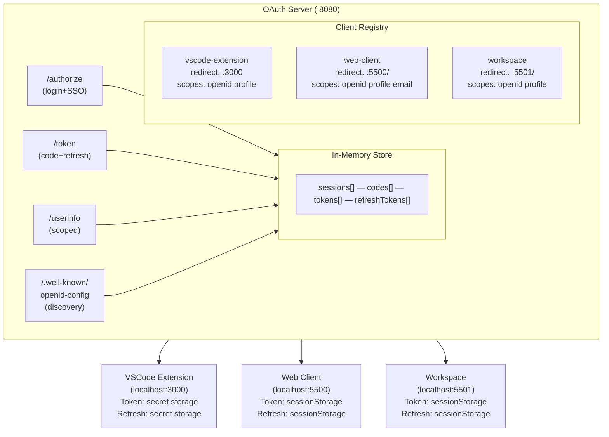
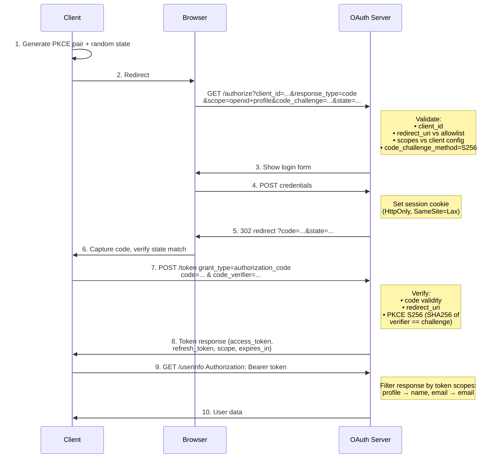
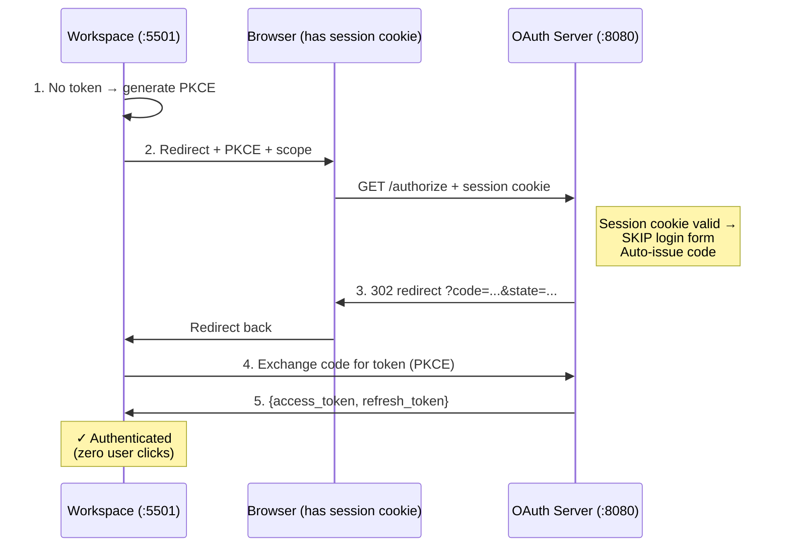
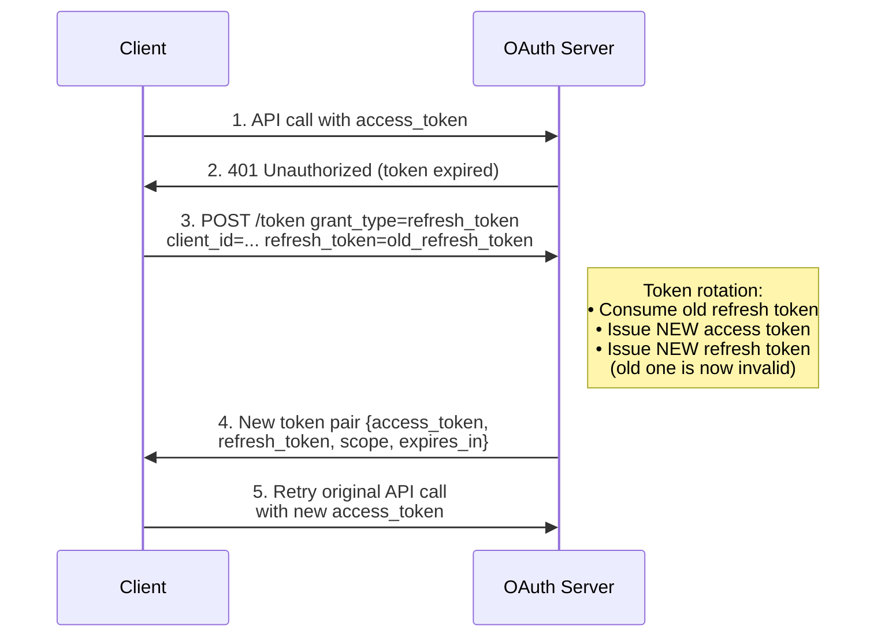
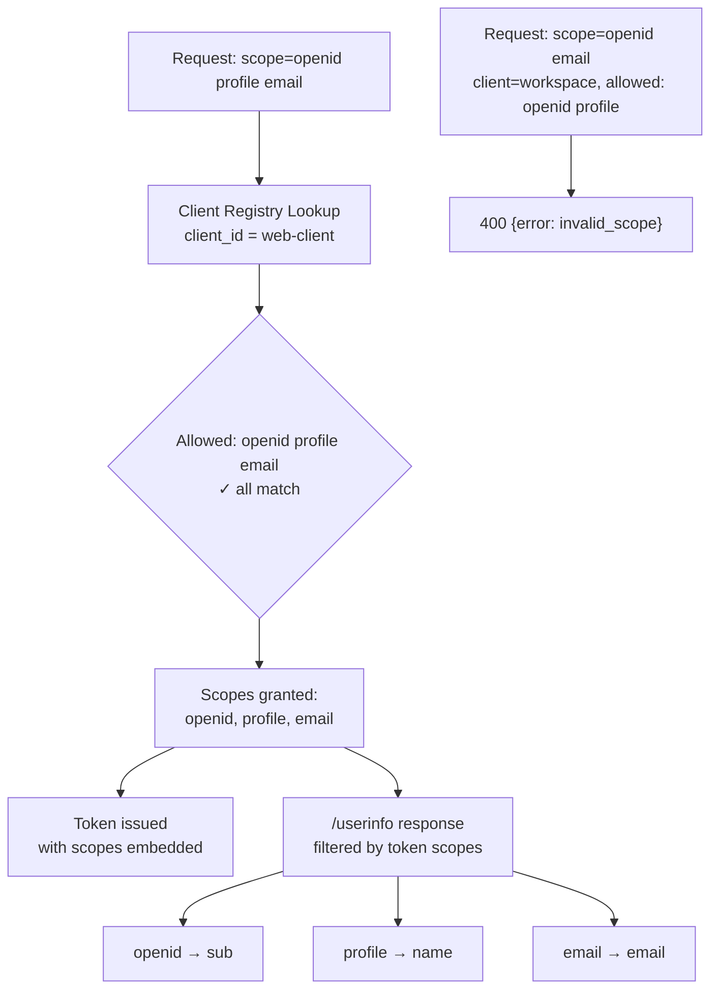
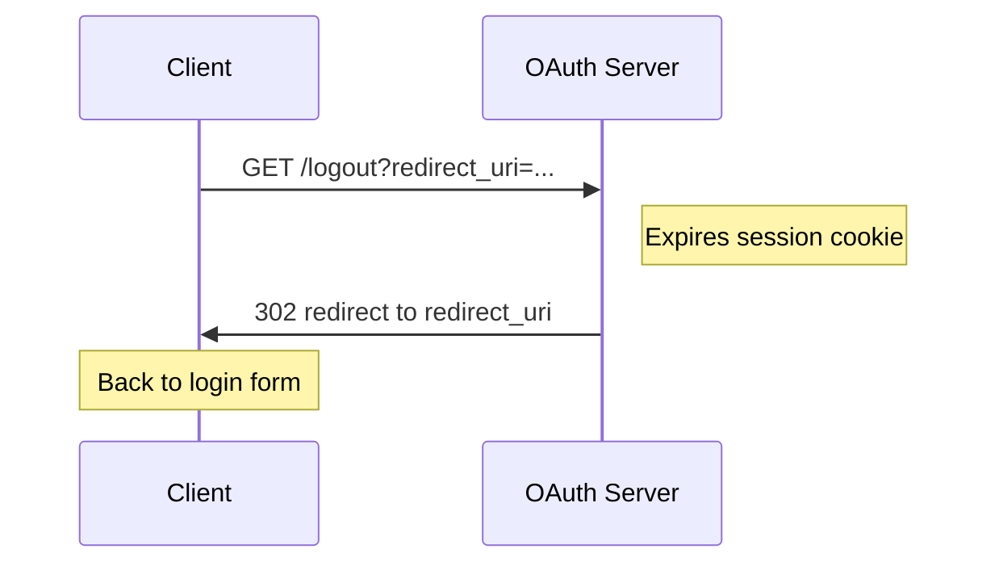

# OAuth Server + Clients Example

Minimal OAuth 2.0 Authorization Code with PKCE flow: a Go server, a web client, a workspace app (SSO), and a VSCode extension.

## Architecture

### System Overview



### Direct Login Flow (web-client, VSCode extension)



### SSO Flow (workspace, launched from oauth-server dashboard)



### Refresh Token Flow (all clients)



Token lifetimes:

| Token | Lifetime |
|-------|----------|
| access_token | 1 hour |
| refresh_token | 30 days |
| auth_code | 10 min |
| session cookie | 24 hours |

### Scope Validation Flow



### Discovery Endpoint

`GET /.well-known/openid-configuration` returns:

```json
{
  "issuer": "http://localhost:8080",
  "authorization_endpoint": ".../authorize",
  "token_endpoint": ".../token",
  "userinfo_endpoint": ".../userinfo",
  "end_session_endpoint": ".../logout",
  "response_types_supported": ["code"],
  "grant_types_supported": ["authorization_code", "refresh_token"],
  "scopes_supported": ["openid", "profile", "email"],
  "code_challenge_methods_supported": ["S256"],
  "token_endpoint_auth_methods_supported": ["none"]
}
```

Clients can auto-discover all endpoints and capabilities instead of hardcoding URLs.

### Logout Flow



## Project Structure

```
oauth-server/          Go OAuth 2.0 authorization server
├── main.go            All endpoints + client registry + in-memory store
└── go.mod

web-client/            Vanilla HTML/JS SPA (no dependencies)
└── index.html         Auth Code + PKCE, scopes, refresh tokens

workspace/             Vanilla HTML/JS SPA (no dependencies)
└── index.html         Auto-authenticates via SSO (silent redirect)

vscode-extension/      VSCode extension (TypeScript)
├── src/
│   ├── extension.ts       Commands: Sign In, Sign Out, Get User Info
│   └── authProvider.ts    AuthenticationProvider with PKCE + refresh
├── package.json
└── tsconfig.json
```

## Server Endpoints

| Method | Path                              | Description                                              |
|--------|----------------------------------|----------------------------------------------------------|
| GET    | `/authorize`                      | Login form, or silent redirect if session cookie set     |
| POST   | `/authorize`                      | Validates credentials, sets session cookie               |
| POST   | `/token`                          | Token exchange (authorization_code + refresh_token)      |
| GET    | `/userinfo`                       | Scoped user info (requires Bearer token)                 |
| GET    | `/logout`                         | Clears session cookie, redirects to `redirect_uri`       |
| GET    | `/.well-known/openid-configuration` | Discovery document (endpoints, scopes, grant types)    |

## Quick Start

### 1. Start the OAuth server

```bash
cd oauth-server
go run .
```

Server runs on `http://localhost:8080`.

### 2. Open the web client

```bash
cd web-client
python3 -m http.server 5500
```

Open `http://localhost:5500` → click **Sign In** → log in with `demo` / `demo` → redirected back with token.

### 3. Try SSO with workspace

```bash
cd workspace
python3 -m http.server 5501
```

Go to `http://localhost:8080/authorize` → log in → click **Launch Workspace** → workspace opens and is automatically authenticated (no second login).

### 4. Launch the VSCode extension

```bash
cd vscode-extension
npm install
npm run compile
code --extensionDevelopmentPath=$(pwd)
```

1. Open Command Palette (`Cmd+Shift+P`)
2. Run **OAuth Demo: Sign In**
3. Browser opens → log in with `demo` / `demo`
4. Redirects back → extension receives token
5. Run **OAuth Demo: Get User Info** to verify

## Demo Credentials

| Username | Password |
|----------|----------|
| `demo`   | `demo`   |

## Architecture Trade-offs and Limitations

### In-memory storage

All auth codes, tokens, sessions, and refresh tokens are stored in Go `map`s behind a `sync.RWMutex`:

- **All state lost on server restart** — tokens and sessions disappear
- **No horizontal scaling** — can't run multiple server instances behind a load balancer
- **No token revocation propagation** — a real system would use Redis, a database, or signed JWTs

### Session cookie security

- **SameSite=Lax** — protects against CSRF on POST but allows the cookie to be sent on top-level GET redirects (required for SSO flow to work)
- **No Secure flag** — set because we're on `http://localhost`. Production must use `Secure; SameSite=Strict` over HTTPS
- **HttpOnly** — prevents JavaScript access to session cookie (good), but means the client can't inspect session state

### Token storage on clients (web-client, workspace)

- Access + refresh tokens stored in **`sessionStorage`** — not accessible to other tabs, lost on tab close
- **Not in `localStorage`** — avoids persistence across sessions, but means each tab needs its own auth flow
- **Not in HttpOnly cookies** — would be more secure against XSS, but requires a backend-for-frontend (BFF) pattern which adds complexity
- **Vulnerable to XSS** — any injected script in the page can read `sessionStorage` and steal tokens. Real apps should use a BFF or `HttpOnly` cookie approach

### PKCE without client secrets

- All clients are **public clients** (no client secret) — correct for SPAs and native apps per OAuth 2.1
- PKCE prevents authorization code interception, but **does not authenticate the client itself**
- Redirect URI allowlist per client mitigates rogue-client attacks, but doesn't replace client authentication for confidential clients

### Refresh token rotation

- Old refresh token is **consumed on use** — single-use prevents replay
- If a stolen refresh token is used, the legitimate client's next refresh fails — signals compromise
- **No revocation cascade** — a real system should revoke all tokens in the family when reuse is detected (see OAuth Security BCP)

### SSO silent redirect

- Works because the browser sends the session cookie to the OAuth server during the redirect
- **User sees a brief flash** — browser navigates to OAuth server and back. Could use a hidden iframe for a smoother experience, but that adds complexity and cross-origin restrictions
- **Session fixation risk** — mitigated by generating a new session ID on each login
- **No consent screen** — the server auto-issues codes for any registered client when a session exists. A real IdP should prompt for user consent per-client on first use

### Scope limitations

- Scopes are validated against a static per-client allowlist — no dynamic consent or per-user permission grants
- `/userinfo` response filtering is basic (profile → name, email → email) — a real OIDC provider returns standardized claim sets
- No scope downgrading on refresh — refresh token reuses the original scopes

### Hardcoded URLs and ports

- All client apps have `localhost:8080` hardcoded for the OAuth server
- Workspace URL (`localhost:5501`) is hardcoded in the server's dashboard template
- Production should use the `/.well-known/openid-configuration` discovery endpoint to resolve URLs dynamically

### No HTTPS

- All communication is unencrypted `http://localhost`
- Tokens and credentials are visible in transit — fine for local development, unacceptable in production
- `crypto.subtle` (used for PKCE SHA-256 in the browser) requires a secure context — works on `localhost` but would fail on plain HTTP in production
